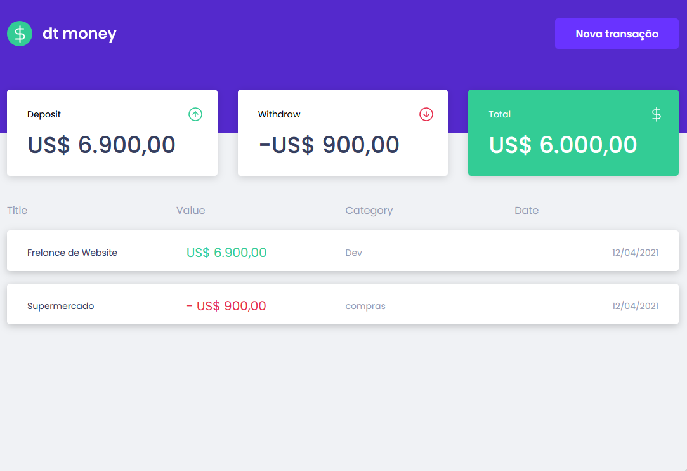
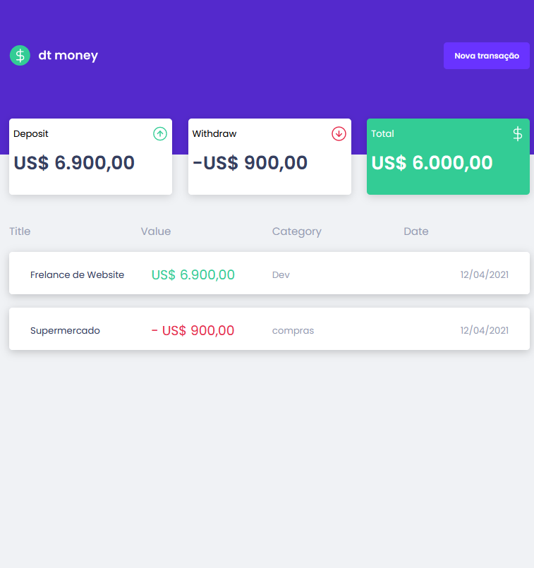
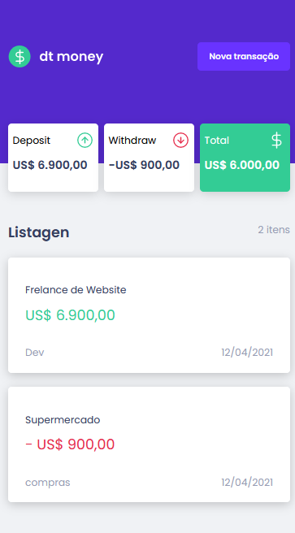

  

<section style="width:100%; text-align: center; margin-top: 2rem;">

  #### Desktop

  

</section>

<section style="width:100%; text-align: center; margin-top: 2rem;">

#### Tablet

 
  

</section>

<section style="width:100%; text-align: center; margin-top: 2rem;">

#### Mobile

  
  

</section>

--------

# Getting Started with Create React App

This project was bootstrapped with [Create React App](https://github.com/facebook/create-react-app).

## Available Scripts

In the project directory, you can run:

### `yarn start`

Runs the app in the development mode.\
Open [http://localhost:3000](http://localhost:3000) to view it in the browser.

The page will reload if you make edits.\
You will also see any lint errors in the console.

## Learn More

You can learn more in the [Create React App documentation](https://facebook.github.io/create-react-app/docs/getting-started).

To learn React, check out the [React documentation](https://reactjs.org/).
